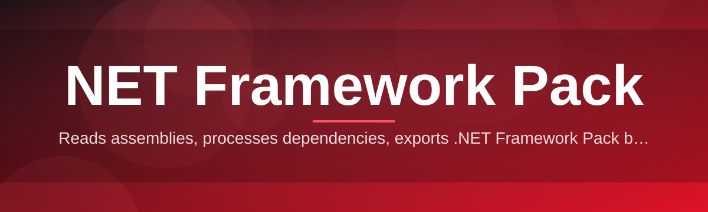

# net-framework-pack-optimizer 🧩⚙️

  

*Stop letting a bloated runtime pack squat on your drive and your boot time — trim it, tune it, move on with your life.*

---

## ⚡ Quick Start (because nobody reads manuals in 2026)

1. Grab the tool from the landing page button below — no installer wizard nonsense.

2. Run the `.exe`, let it scan your installed NET Framework Pack components.

3. Click **Optimize**, grab a coffee, come back to a leaner system.

That's it. Everything past this point is context for the curious and ammo for the skeptical.

---

## 🧠 Overview

Let's be honest: the **NET Framework Pack** is one of those pieces of Windows infrastructure everyone has, nobody thinks about, and almost nobody maintains properly. It quietly ships with dozens of runtime components, language packs, servicing stacks, and legacy compatibility shims — most of which you're never actively using but all of which are actively using *your* disk, your indexing service, and your patience during Windows Update.

`net-framework-pack-optimizer` exists because I got tired of watching perfectly good machines choke on redundant framework versions stacked like geological sediment. This tool inspects your installed **.NET Framework Pack** footprint, maps out what's actually load-bearing versus what's dead weight from three OS upgrades ago, and gives you a clean, reversible path to reclaim space and responsiveness — without the guesswork of manually poking around `DISM` output or praying to the Control Panel gods.

It's built for developers running multiple SDKs side by side, IT admins managing fleets of Windows machines, and power users who just want their system to stop feeling like it's dragging an anchor. If you've ever opened "Programs and Features," seen six different Framework Pack entries, and thought *"do I need all of this?"* — yes, this project is speaking directly to you.

  

---

## 🔥 What This Thing Actually Does For You

  

- **Deep Component Mapping** — instead of trusting the vague labels Windows gives you, the optimizer walks the actual dependency graph of your installed NET Framework Pack versions so you know what's load-bearing before you touch anything.

- **Redundancy Detection** — flags overlapping runtime versions that coexist for no good reason, the digital equivalent of owning four identical umbrellas.

- **Safe Trim Profiles** — presets ranging from *Conservative* (barely touches anything) to *Aggressive* (for people who enjoy living dangerously but not *that* dangerously).

- **One-Click Restore Point** — every optimization pass snapshots the relevant state first, because "trust me" is not a rollback strategy.

- **Boot Impact Scoring** — ranks each Framework Pack component by how much it's actually dragging on startup, not by vibes.

- **Silent Background Mode** — schedule scans that run quietly and just notify you when there's something worth cleaning, no popup theater.

- **Offline-First Design** — no telemetry phoning home, no cloud dependency, because your system inventory is nobody else's business.

- **Portable Reports** — export a plain-text or JSON summary of your Framework Pack health, handy for IT tickets or just bragging rights.

> [!TIP]
> Run the **Conservative** profile first on any machine you actually care about. You can always go aggressive on your second pass once you trust the results.

---

## 🚀 How To Get Started

1. Visit the project landing page (button above or below) and download the current build.

2. Extract if zipped, then launch the executable — no setup wizard, no dependency chasing.

3. Let the initial scan complete; this builds your local Framework Pack inventory.

4. Choose an optimization profile and apply — a restore point is created automatically before anything changes.

> [!NOTE]
> First scan can take a minute or two on machines with a long Windows Update history. That's the tool being thorough, not slow.

---

## 🖥️ System Requirements

| Requirement | Detail |
|---|---|
| OS | Windows 10 (64-bit) or Windows 11 |
| Architecture | x64 |
| Dependencies | None — fully standalone |
| Disk Space | ~40 MB for the tool itself |
| Admin Rights | Required for applying optimizations |
| Internet | Only needed to download the tool |

<strong>Why no installer?</strong>

Installers are great until you need to move a tool between machines quickly or run it from a USB drive during a support call. Portable-first design means you drop it, run it, and leave no residue behind if you decide it's not for you.

---

## 🧭 How It Works

The whole pipeline is intentionally linear — no hidden background daemons, no mystery scheduling beyond what you explicitly set up.

1. **Scan** — enumerate every installed NET Framework Pack component, version, and servicing branch.

2. **Map** — cross-reference each component against a dependency table to see what's actually required by installed applications.

3. **Score** — rank components by redundancy, boot-time cost, and disk footprint.

4. **Snapshot** — capture a restore point before touching anything.

5. **Apply** — execute the chosen optimization profile and report results.

> [!IMPORTANT]
> The Snapshot step is not optional and cannot be skipped, even in Aggressive mode. This is the one guardrail we refuse to remove.

---

## 🛟 Troubleshooting

**Q: The scan says a component is "orphaned" but I swear I use an app that needs it.**
A: Close the app fully and rescan — some apps hold a version loaded in memory even when idle, which can produce false orphan flags.

**Q: My restore point failed to create — can I still optimize?**
A: The tool blocks optimization until snapshotting succeeds. Check that System Protection is enabled on your target drive; this is a Windows setting, not something we can override.

**Q: I ran Aggressive mode and now an old application won't launch.**
A: Use the built-in **Restore Last Snapshot** option from the main menu. This reverts the specific Framework Pack changes without touching your personal files.

**Q: Why does the tool need admin rights just to scan?**
A: It doesn't — scanning runs fine without elevation. Admin rights are only requested when you click Apply, since that's the step that actually modifies system components.

**Q: Does this work on Windows Server editions?**
A: Officially unsupported for now. It may run, but the servicing stack differs enough that we can't guarantee safe results.

**Q: Will this conflict with Windows Update?**
A: No — optimizations respect the same servicing APIs Windows Update itself uses, so there's no fight for control happening under the hood.

---

## 🎨 UI / UX Details

- **Themes** — Light, Dark, and an actual proper high-contrast mode for accessibility, not an afterthought slapped on last minute.

- **Keyboard Shortcuts**:

  | Shortcut | Action |
  |---|---|
  | `Ctrl+R` | Run new scan |
  | `Ctrl+O` | Apply optimization profile |
  | `Ctrl+Z` | Restore last snapshot |
  | `Ctrl+E` | Export report |
  | `F1` | Open help panel |

- **Settings Persistence** — your last-used profile, theme, and scan schedule are remembered between sessions, stored locally in a plain config file you can inspect or edit yourself.

- **Compact Mode** — collapses the interface into a minimal status bar for people who just want a quiet background utility, not another window competing for taskbar space.

---

## 🤝 Contributing & Community

This project grows because people using it in the wild find edge cases we never would've thought of. If you spot a Framework Pack configuration that trips up the scanner, or you've got an idea for a smarter trim profile, open an issue.

> [!TIP]
> Before filing a bug, attach an exported report (`Ctrl+E`). It saves everyone a dozen back-and-forth questions.

- Fork it, branch it, PR it — standard flow, no ceremony required.
- Discussions tab is open for feature debates and "is this safe to remove" sanity checks.
- Be blunt but kind in reviews. Code quality goes up, patience goes down otherwise.

> [!WARNING]
> Please don't submit PRs that disable the Snapshot step or add silent telemetry. Those will be closed without much discussion — it's a trust thing.

---

## 📄 License

Released under the [MIT License](LICENSE), 2026. Use it, fork it, embed it in your own toolkit — just keep the attribution intact.

---

## ⚖️ Disclaimer

This tool modifies system-level components of the Windows NET Framework Pack. While every optimization pass creates a restore point first, you are ultimately responsible for backing up critical systems before running any optimization software. The maintainers provide this project as-is, with no warranty, and are not liable for issues arising from misuse, unsupported OS versions, or ignoring the restore point that was literally created for you.

---

  

